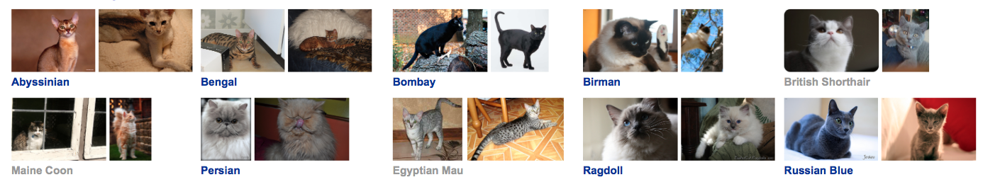

## Introduction   

### Motivation
	  
Image classification problem is the task of assigning an input image one label from a fixed set of categories. This is one of the core problems in Computer Vision that, despite its simplicity, has a large variety of practical applications.
 
Traditional way: Feature Description and Detection. 

Maybe good for some sample task, but the actual situation is far more complicated. 

	
Therefore, instead of trying to specify what every one of the categories of interest look like directly in code, we're going to use machine learning, which is providing the computer with many examples of each class and then develop learning algorithms that look at these examples and learn about the visual appearance of each class. 

However, image classification problem is such a complicated work that always been done with deep learning model like Convolutional Neural Network. We already learnt that many algorithms we studied in class like KNN and SVM usually do a great job on many data mining problems. But it seems that they are sometimes not the best choices for image classification problems. 

So we would like to compare the performance among the algorithms we learnt in class and CNN and Transfer Learning. 

### Objective
	
Our Objective is to: 
	
1. Compare normal algorithms we learnt in class with other methods that are usually used in industry on image classification problem .
2. Find a fast and acurate method that could run on a common laptop or smartphone. 
3. Explore the machine learning framework by Google - TensorFlow. 

## System Design & Implementation details

### Algorithms and Tools

The 5 methods we used in this project are KNN, SVM, BP Neural Network, Convolutional Neural Network and Transfer Learning. 

The whole project is divided into 3 parts. 

- **The first part**: Used **KNN, SVM and BP Neural Network**, which are algorithms we learnt in class. There are powerful and easy to implement. We mainly used **sklearn** to implement those algorithms. 

- **The second part**: While traditional multilayer perceptron (MLP) models were successfully used for image recognition, due to the full connectivity between nodes they suffer from the curse of dimensionality and thus do not scale well to higher resolution images. So in this part we built a **CNN** using deep learning frame work by Google - **TensorFlow**.  

-  **The third part**: Retrained the last layer of a pretrained deep neural network called **Inception V3**, also provided by **TensorFlow**. 
Inception V3 is trained for the ImageNet Large Visual Recognition Challenge using the data from 2012. This is a standard task in computer vision, where models try to classify entire images into 1000 classes, like "Zebra", "Dalmatian", and "Dishwasher". In order to retrain this pretrained network, we need to ensure that our own dataset is not already pretrained.

### Implementation

- **The first part:** 

- **The second part**:  **Built CNN with TensorFlow**
The entire purpose of TensorFlow is to let you build a computational graph (using any languages like Python) and then execute the graph in C++, which is much more efficiently than if the same calculations were to be performed directly in Python. 

	TensorFlow can also automatically calculate the gradients that are needed to optimize the variables of the graph so as to make the model perform better. This is because the graph is a combination of simple mathematical expressions so the gradient of the entire graph can be calculated using the chain-rule for derivatives.
	
	A TensorFlow graph consists of the following parts which will be detailed below:
	- Placeholder variables used for inputting data to the graph.
	- Variables that are going to be optimized so as to make the convolutional network perform better.
	- The mathematical formulas for the convolutional network.
	- A cost measure that can be used to guide the optimization of the variables.
	- An optimization method which updates the variables.

	A CNN architecture is formed by a stack of distinct layers that transform the input volume into an output volume (e.g. holding the class scores) through a differentiable function. 
	
	So in our implementation,  at first we built **3 Convolutional layers** with **2 x 2 max-pooling and Rectified Linear Unit (ReLU)**. 
	The input is a 4-dim tensor with the following dimensions:
	
	- Image number.
	- Y-axis of each image.
	- X-axis of each image.
	- Channels of each image.

	The output is another 4-dim tensor with the following dimensions:
	
	- Image number, same as input.
	- Y-axis of each image. If 2x2 pooling is used, then the height and width of the input images is divided by 2.
	- X-axis of each image. Ditto.
	- Channels produced by the convolutional filters.
	
	
	And then we built **2 Fully-Connected Layers** at the end of the network. 
	The input is a 2-dim tensor of shape [num_images, num_inputs]. The output is a 2-dim tensor of shape [num_images, num_outputs]
	
	However to connect Convolutional layers and Fully-Connected Layers we need a **Flatten Layer** to reduce the 4-dim tensor to 2-dim which can be used as input to the fully-connected layer. 
	
	The shape of every layer is here. 
		
		# Convolutional Layer 1.
		filter_size1 = 5 
		num_filters1 = 32
		
		# Convolutional Layer 2.
		filter_size2 = 5
		num_filters2 = 64
		
		# Convolutional Layer 3.
		filter_size3 = 3
		num_filters3 = 64
		
		# Fully-connected layer.
		fc_size = 128             	

	The very end of CNN is always a **softmax layer** which normalize the output from Fully-connected layer so that each element is limited between 0 and 1 and all the elements sum to 1.
	
	To **optimize** the traning result we need a cost mearsure and try to minmize it every iternation. 
	The **Cost function**  we used here is **cross entropy** (called from tf.nn.oftmax_cross_entropy_with_logits()), and take the average of cross-entropy for all the image classifications. 
	The **Optimization Method** is tf.train.AdamOptimizer() which is an advanced form of **Gradient Descent.** The is a parameter **learning rate** which could be adjusted. 
	
	
## Experiments 

### Dataset
The Oxford-IIIT Pet Dataset: [link](http://www.robots.ox.ac.uk/~vgg/data/pets/)

There are 25 breeds of dog and 12 breeds of cat. Each breed has 200 images. 

We only used 10 cat breeds in our project. 

The classes we used here is 
 ['Sphynx','Siamese','Ragdoll','Persian','Maine_Coon','British_shorthair','Bombay','Birman','Bengal','Abyssinian']

The sizes are different with each other. But we resized them into fixed sizes like 64 x 64 or 128 x 128. 

### Preprocessing

In this project we mainly used OpenCV for precessing the image data like read the image into arrary and reshape into the size we need. 

In our learning progress, we find many different ways to preprocess image data, like random cropping, flipping, inverting, sharpen, greyscale. See links here: [https://github.com/aleju/imgaug](https://github.com/aleju/imgaug). However we don't have enough time to test on those techniques. 

### Evalutaion
- **The first part:** 

- **The second part**:  **Built CNN with TensorFlow**

	It takes a long time to calculate the gradient of the model using the entirety of a large dataset . We therefore only use a small batch of images in each iteration of the optimizer. The batch size is normaly 32 or 64. 
	The dataset is divided into training set contains 1600 images, validation set contains 400 images, and test set contains 300 images.  
	
	There are many **parameters** could be adjusted. 
	
	First is the **learning rate**. A good learning rate is easy find as long as it's small enough that could converge and big enough that it won't make the program too slow. 
We choosed 1 x 10^-4.
	
	The second is the **size of images** we feed to the network. We tried 64*64 and 128 * 128. It turns out that the bigger images, the better accuracy we could get. However the exchange is running time. 
	
	And then is the **layers and their shapes**. However actually there are too many parameters can be adjusted so it's a very hard work to find the best values for all of them. 
	According to many resources from internet, we learnt that the parameter choosing for building the network is pretty much rely on experience. And it' always good to maintain a gradient between each layers. So we just used parameters for layers that are commanly used in some related topics found online. And we did try to adjust it, but we didn't get obvious improvement.
	
	As a result, we roughly achieved 65% accuracy after 10000 iterations, and the running time is over an hour. 

	 

