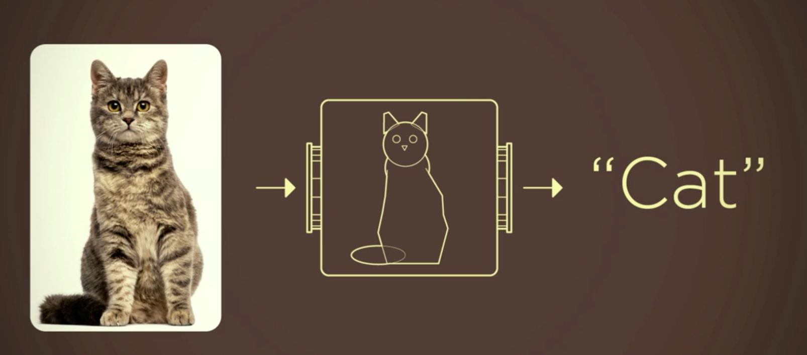
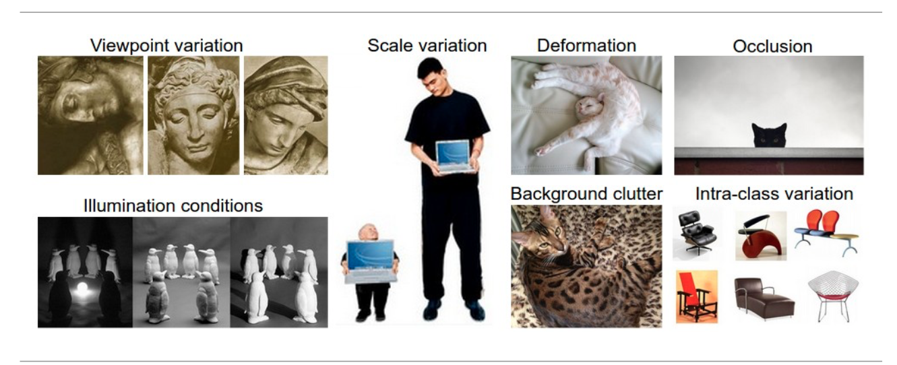

## Introduction   

### Motivation
	  
Image classification problem is the task of assigning an input image one label from a fixed set of categories. This is one of the core problems in Computer Vision that, despite its simplicity, has a large variety of practical applications.
 
Traditional way: Feature Description and Detection. 

Maybe good for some sample task, but the actual situation is far more complicated. 

	
Therefore, instead of trying to specify what every one of the categories of interest look like directly in code, we're going to use machine learning, which is providing the computer with many examples of each class and then develop learning algorithms that look at these examples and learn about the visual appearance of each class. 

However, image classification problem is such a complicated work that always been done with deep learning model like Convolutional Neural Network. We already learnt that many algorithms we studied in class like KNN and SVM usually do a great job on many data mining problems. But it seems that they are sometimes not the best choices for image classification problems. 

So we would like to compare the performance 

### Objective
	
Our Objective is to: 
	
1. Compare normal algorithms we learnt in class with other methods that are usually used in industry on image classification problem .
2. Find a fast and acurate method that could run on a common laptop or smartphone. 
3. Explore the machine learning framework by Google - TensorFlow. 

## System Design & Implementation details

### Algorithms

So we would like to compare the speed and accruacy between , we used 5 different ways to classify the breeds of cat. They are: KNN, SVM, BP Neural Network, Convolutional Neural Network. And we also tried retraining the last layer of a pretrained deep network on imageNet by Google.

### Technologies & Tools 

### Normal methods

For the purpose of image recognition, we first tried the k-nearest neighbors(k-NN), the neural network MLP classifier and SVM-SVC in sklearn package without deep learning. We will show the implementation details and sample output with discussion in the rest of this section.

## Preprocessing

In this project we mainly used OpenCV for precessing the image data like read the image into arrary and reshape into the size we need. 

In our learning progress, we find many different ways to preprocess image data, like random cropping, flipping, inverting, sharpen, greyscale. See links here: [https://github.com/aleju/imgaug](https://github.com/aleju/imgaug). However we don't have enough time to test on those techniques. 

## Method

The CNN here wa

## Dataset
The Oxford-IIIT Pet Dataset: [link](http://www.robots.ox.ac.uk/~vgg/data/pets/)

There are 25 breeds of dog and 12 breeds of cat. Each breed has 200 images. 

We only used 10 cat breeds in our project. 

The classes we used here is 
 ['Sphynx','Siamese','Ragdoll','Persian','Maine_Coon','British_shorthair','Bombay','Birman','Bengal','Abyssinian']

The sizes are different with each other. But we resized them into fixed sizes like 64 x 64 or 128 x 128. 